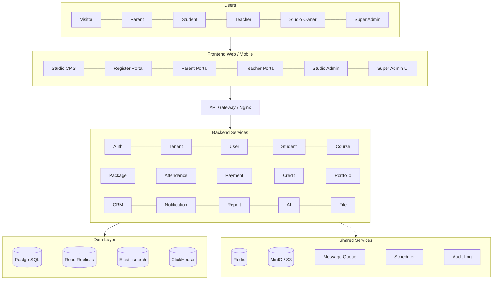
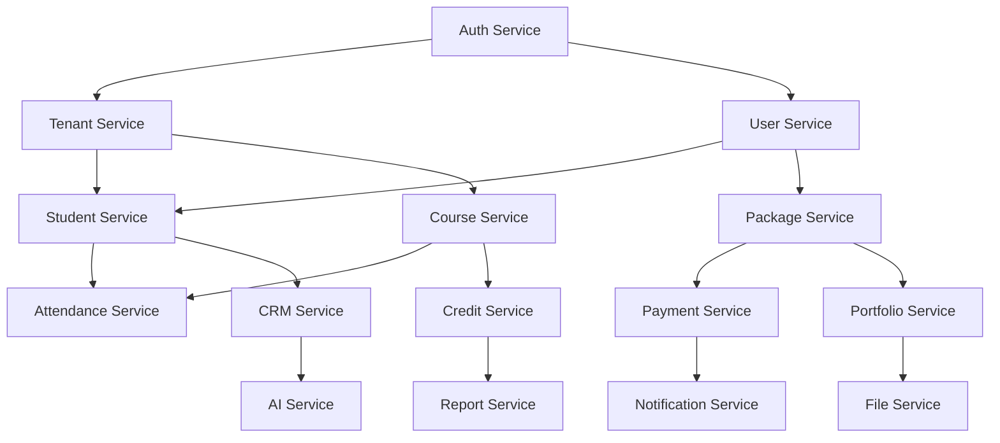
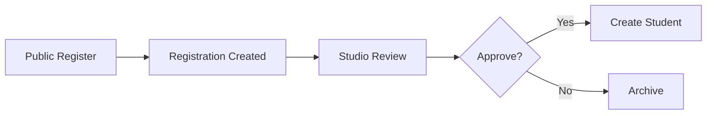
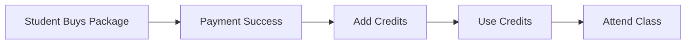

# StudioSaaS Architecture

Version: v3.0
Date: 2026-07-03
Purpose: Current system architecture, routing model, file layout, data flow — plus the target architecture (v2 vision) and its adoption policy.

---

## 1. Current System Architecture

```
┌─────────────────────────────────────────────────────────────┐
│  Browser (Desktop / iPad / Mobile)                          │
└──────┬──────────────────────┬───────────────────┬──────────┘
       │                      │                   │
       ▼                      ▼                   ▼
┌─────────────┐   ┌──────────────────┐  ┌─────────────────┐
│ Super Admin │   │  Studio Admin    │  │  Parent Portal  │
│  Dashboard  │   │   (per tenant)   │  │   (public)      │
└──────┬──────┘   └────────┬─────────┘  └────────┬────────┘
       │                   │                      │
       └───────────────────┼──────────────────────┘
                           │
                    ┌──────▼──────┐
                    │  Flask API  │
                    │  server.py  │
                    │  /v1/*      │
                    └──────┬──────┘
                           │
              ┌────────────┼────────────┐
              │            │            │
              ▼            ▼            ▼
       ┌──────────┐ ┌──────────┐ ┌───────────┐
       │Tenants   │ │Students  │ │ Portfolios│
       │Plans     │ │Courses   │ │Media      │
       │Subscriptions│Packages │ │Registrations│
       │AuditLogs  │ │Credits   │ │ShareTokens │
       └──────────┘ └──────────┘ └───────────┘
              ▲
              │
       ┌──────▼──────┐
       │ PostgreSQL  │
       │ (RDS later) │
       └─────────────┘
```

### 1.1 Architecture Principles

- `backend/` is the canonical runtime directory.
- `tenant_id` is the isolation boundary for all business data.
- Tenant context is resolved from URL path, header, or subdomain — never from request body.
- Every mutation route must be authenticated unless explicitly public.
- The tenant CMS (`legacy-root/` served at `/<slug>/cms`) is the **core operating surface** — tenants run scheduling, check-ins, students, fees, refunds, logs, analytics, registration review, and portfolio work there.
- Studio Admin (`/<slug>/studio-admin`) is the **website/brand and lead-capture console** — logo, colours, public copy, registration fields, generated surface links, and audited exports. It must not become a second daily operations UI.

---

## 2. URL Model

### 2.1 Platform Routes

| Route | Surface |
|---|---|
| `/` | Super Admin dashboard |
| `/super-admin` | Super Admin dashboard (alias) |
| `/register` | Closed (404) — registration belongs to tenants |
| `/v1/*` | Platform and tenant API v1 |

### 2.2 Tenant Routes

| Route | Surface |
|---|---|
| `/<tenant_slug>` | Tenant public portal generated from `tenant-template/index.html` |
| `/<tenant_slug>/cms` | Tenant CMS daily operations shell |
| `/<tenant_slug>/studio-admin` | Website/brand and registration-form console |
| `/<tenant_slug>/register` | Tenant registration |
| `/s/<tenant_slug>/v1/*` | Tenant-scoped API prefix |

### 2.3 Reserved Slugs

`api`, `v1`, `register`, `super-admin`, `studio-admin`, `vendor`, and asset filenames cannot be used as tenant slugs.

### 2.4 Tenant Resolution Order

1. `/s/{tenant_slug}/...` (path-based)
2. `X-Tenant-Slug` header
3. Subdomain (e.g., `lets-paint.studiosa.as`) — future

---

## 3. File Structure

```
studiosaas/
├── super-admin.html              # Platform dashboard (~1685 lines)
├── start_studiosaas_local.sh     # Local startup script
├── START_STUDIOSAAS_LOCAL.command # macOS double-click launcher
│
├── backend/                      # Canonical runtime
│   ├── server.py                 # Flask application (~1560 lines)
│   ├── studiosaas/
│   │   ├── api_v1.py             # All API routes (~4040 lines — split planned, P2-01)
│   │   ├── auth.py               # Auth helpers, decorators (super_admin_required etc.)
│   │   ├── models.py             # Role/TenantStatus enums, Tenant/Actor contexts
│   │   ├── audit.py              # Audit log writer
│   │   ├── config.py             # Environment configuration
│   │   ├── db.py                 # Database connection
│   │   ├── migration.py          # Legacy data migration helpers
│   │   ├── tenant_context.py     # Tenant resolution
│   │   └── workspaces.py         # Tenant folder generation
│   ├── db/
│   │   └── schema_v1.sql         # Full schema definition (18 tables)
│   ├── scripts/
│   │   ├── seed_super_admin.py
│   │   ├── seed_local_test_tenants.py
│   │   ├── seed_random_demo_data.py
│   │   ├── import_lets_paint_json.py
│   │   ├── migrate_legacy_media.py
│   │   └── verify_local.sh
│   ├── frontend/
│   │   └── studio-admin.html     # Shared Studio Admin page (~2426 lines)
│   ├── vendor/                   # react/babel/tailwind runtime bundles (P2-03: prebuild)
│   ├── test_cms.py               # Legacy smoke test (73 checks, script-style)
│   ├── test_tenant_isolation.py  # Isolation test (script-style)
│   ├── pytest.ini
│   └── requirements.txt
│
├── legacy-root/                  # Tenant CMS (core product surface)
│   ├── index.html                # CMS shell with request bridge (~3668 lines)
│   └── register.html             # Register shell with request bridge (~797 lines)
│
├── tenant-template/              # Template for new tenants
│   ├── index.html
│   ├── studio-admin.html
│   └── register.html
│
├── tenants/                      # Generated tenant workspaces
│   ├── lets-paint-studio/
│   ├── lets-play-piano/
│   └── lets-play-game/
```

### 3.1 Directory Strategy

- `backend/` is the canonical runtime. The previous `letspaint-cms-release/` tree has been removed (2026-07-03, intentional).
- `legacy-root/` is a runtime bridge, not an archive. Tenant wrappers use it to host the old CMS/Register UI while request interception routes data into tenant-scoped PostgreSQL APIs.
- `tenant-template/` is the template source. When a tenant is created, StudioSaaS copies these files into `tenants/<slug>/` and renders `{{TENANT_SLUG}}` and `{{TENANT_NAME}}`.
- `tenants/<slug>/` are generated workspaces, one per tenant. **Policy (2026-07-03):** generated workspaces are tracked in git — they are small HTML wrappers and tracking them keeps local environments reproducible. Commit new workspaces when tenants are created; they can be regenerated from `tenant-template/` at any time.

---

## 4. Data Flow

### 4.1 Tenant Creation Flow

1. Super Admin creates tenant with name, slug, plan, status, and subscription dates.
2. API validates the slug against reserved words.
3. API inserts `tenants`, `subscriptions`, and `tenant_usage` rows.
4. API creates `tenants/<slug>/` from `tenant-template/`.
5. API stores `settings.workspace_path` on the tenant row.
6. Audit log records `tenant.created`.

### 4.2 Studio Admin Brand Sync

```
Studio Admin → /s/<tenant_slug>/v1/tenant → PostgreSQL tenant row/settings → Portal/CMS/Register
```

| Studio Admin area | API/database source | Public consumer |
|---|---|---|
| Studio name | `PATCH /s/<slug>/v1/tenant` → `tenants.name` | `/v1/public/<slug>/brand`, portal, CMS wrapper, register wrapper |
| Logo | upload `/s/<slug>/v1/tenant/logo` → `tenants.settings.logo_url` | Portal/CMS/Register logo replacement |
| Primary/secondary colors | `tenants.primary_color`, `tenants.secondary_color` | Portal/CMS/Register CSS variables |
| Welcome message | `tenants.welcome_message` | Public brand payload, portal/CMS/Register welcome areas |
| CMS layout | `tenants.settings.cms_layout` | CMS/Register wrapper (`bar`, `hero`, `compact`) |
| Show welcome | `tenants.settings.show_welcome` | Controls welcome visibility |
| Industry category | `tenants.settings.category` | Presets for public copy and registration fields |
| Public slogan | `tenants.settings.slogan` | CMS login surfaces, portal, register header |
| Registration profile | `tenants.settings.registration_profile` | Register form labels/placeholders and CMS create-student preferences |
| Copy pack | `tenants.settings.copy_pack` | Public portal labels and register intro |
| Contact phone/email/address | `tenants.contact_*` | Public contact strip |

Daily operations stay in the CMS: courses/packages, students, credit ledger, attendance, registration review, rosters, logs, analytics, and portfolio edits.

### 4.3 Legacy Bridge Integration

The legacy CMS shell (`legacy-root/index.html`) intercepts old calls to `/api/data` and `/api/save` and rewrites them to `/s/<tenant_slug>/v1/legacy-cms/data` and `/s/<tenant_slug>/v1/legacy-cms/save`. This keeps the old UI usable while preventing tenant business data from returning to the single-studio JSON path.

The legacy Register shell (`legacy-root/register.html`) intercepts `/api/register` and `/api/balance` and rewrites them to `/v1/public/<tenant_slug>/registrations` and `/v1/public/<tenant_slug>/balance-query`.

---

## 5. Integration Points

| Component | Integration |
|---|---|
| PostgreSQL (local) | Homebrew PostgreSQL 16+/18, database `studiosaas_local_test` |
| PostgreSQL (AWS) | RDS PostgreSQL — future production |
| S3 | Media and portfolio storage — future (`media_assets.storage_provider` reserved) |
| CloudFront | CDN for public assets and portfolio — future |
| SES | Email delivery — future |
| Secrets Manager / SSM | Environment variables and secrets — future |

---

## 6. Known Risks and Weak Points (verified 2026-07-03)

| Area | Issue | Priority |
|---|---|---|
| Browser QA | Playwright smoke coverage is not yet in the repo | P1-06 |
| Legacy residue | `sw.js` still branded "Let's Paint CMS" with platform-level icon cache | P2-02 |
| Code size | `api_v1.py` is ~4100 lines — split along target module boundaries | P2-01 |
| Vendor JS | Runtime Babel/Tailwind compilation in browser | P2-03 |
| Rate limiting | In-memory, per-process — resets on restart (pilot-acceptable; Redis at P3-04) | P3 |

Resolved 2026-07-03 (P0 sprint): role model unification (platform admin = NULL-tenant membership), pytest infrastructure (20 tests), migration runner (`run_migrations.py`), repo hygiene (backend/ was previously untracked by git), login rate limiting + failure audits, route-protection audit (12 unauthenticated tenant GET reads fixed), enum alignment decisions. Earlier: public endpoint rate limiting, dict_row bugs, portfolio DELETE mapping, credit account ON CONFLICT key, HTML branding residue.

---

## 7. Target Architecture (v2 Vision)

Source: StudioSaaS v2 架构总览 (2026-07). This is the **north star**, not the current state. The diagrams below are the canonical Mermaid rendition.

### 7.1 System Overview (target)



### 7.2 Module Dependencies (target)



### 7.3 Key Business Flows (target — partially implemented)





Flow 1 is implemented for the pilot path: public submissions create registration rows, duplicate attempts are marked, Studio Admin can approve into a student or reject/archive with a review note, and all decisions are audited. Flow 2 is implemented at the business-logic level for manual credit purchase/addition, attendance consume, and void/refund; Payment remains deferred (P3-05).

### 7.4 Adoption Policy (what to take now vs later)

| Target element | Adoption | When |
|---|---|---|
| Module boundaries (Auth/Tenant/Student/…​) | **Adopt now** as internal package structure of the Flask monolith | P2-01 split |
| File Service (central media handling) | **Adopt now** as a media service module | P1-03 |
| Attendance + Credit closed loop | **Adopt now** at business-logic level | P1-05 |
| Nginx reverse proxy, Docker, CI | Adopt at staging prep | P3-02 |
| S3/MinIO object storage | Adopt via `storage_provider` branch | P3-03 |
| Redis, read replicas, Elasticsearch, ClickHouse, MQ, Scheduler | **Do not introduce during pilot** | P3-04 / Phase 5 |
| Payment, CRM, Notification, Report, AI services | Deferred, pilot-feedback driven | P3-05 / Phase 3+ |
| FastAPI + SQLAlchemy (poster tech stack) | **Not adopted** — staying on Flask + psycopg through pilot; revisit at Phase 3 | Decision log 2026-07-03 |
| Poster ER diagram (e.g. `users.role`) | **Not canonical** — actual schema keeps roles on `memberships`; `backend/db/schema_v1.sql` wins | — |

---

## 8. Future Architecture Goals

- Split `api_v1.py` into modular route files (`routes/`, `services/`) along §7.2 boundaries.
- Add migration runner (`backend/db/migrations/`, P0-03).
- Add v1 media upload endpoint for portfolio assets (P1-03).
- Add browser automation smoke tests (Playwright, P1-06).
- Replace legacy bridge with modern frontend build.
- Migrate from local PostgreSQL to RDS, local files to S3.
- Add support mode with audit trail for platform staff accessing tenant data.
