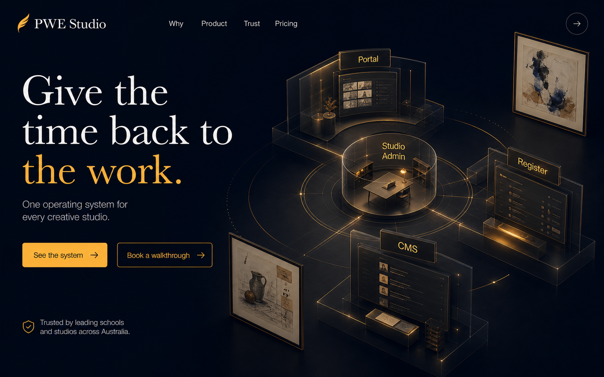
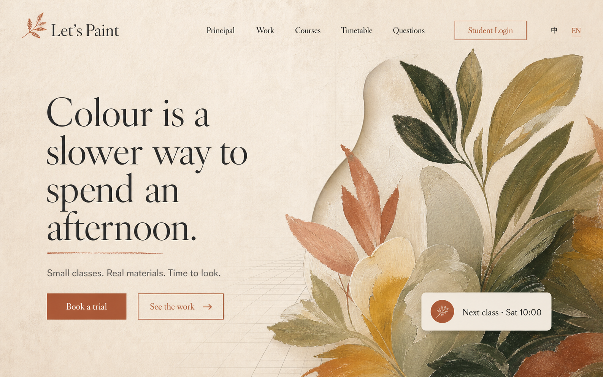
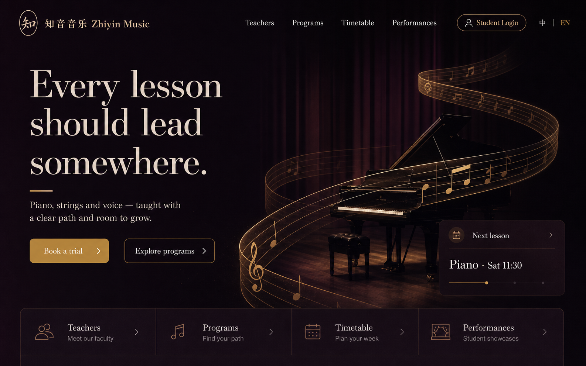

# PWE Studio 门户空间化重构：发散方案与概念效果图

> 日期：2026-08-23
> 状态：概念研究 / 方案轮，不是实施批准
> 范围：PWE Studio 产品门户 + 租户公开门户
> 本轮交付：参考站拆解、技术路线、执行方案、概念图、建议的验证顺序
> 本轮不做：不改运行时代码、不改主题数据契约、不安装依赖、不提交、不部署

> **实施状态（2026-08-24）：** 本文中的产品门户 Phase 1 已作为 v10.14.0
> 候选实现；租户门户 Phase 2 / 3 仍未开始，也不在本次发布范围内。

## 先说结论

可以大胆重构，而且值得做；但“大胆”不应该等于“全站 Three.js”。

更好的方向是：**用原生 HTML 保住内容、转化、SEO、可访问性与租户数据契约，再在少数关键叙事场景上叠加 Canvas / WebGL / 视频。** Three.js 应该是空间叙事的可选渲染器，而不是门户的页面框架。

最值得尝试的产品概念是：

- 产品门户成为 **The Living Studio System**：把 Portal、Register、CMS、Studio Admin 四个界面表达成同一个“工作室空间系统”；
- 客户门户成为 **Tenant Visual Scenes**：同一套内容与交互骨架，根据行业和品牌选择不同的空间场景，例如艺术的 Living Canvas、音乐的 Spatial Score；
- 动效只负责解释关系、制造进入感和维持空间连续性，不负责承载正文、导航、表单或关键 CTA。

## 1. 当前事实边界

本轮核对的是 v10.13.0 当前仓库与 2026-08-23 线上页面，不沿用旧版视觉判断。

| 项目 | 当前事实 | 对重构的含义 |
|---|---|---|
| 产品门户 | `/`，源文件为 `product-home.html`，共享 `marketing.css` / `marketing-shell.js` | 已有清晰内容结构、双语 URL、SEO、定价与转化链，不应推倒内容模型 |
| 租户门户 | `/<slug>`，源模板为 `tenant-template/index.html` | 是数据驱动页面，不是一个固定品牌官网 |
| 公共页面家族 | Portal、Showcase、Timetable、Register 共用公开品牌与导航契约 | 新视觉必须保持跨页面品牌与导航一致性 |
| 主题系统 | 已有 light/dark、行业词汇、形状、按钮、色彩与品牌发布流程 | 不应把某一个艺术样板的视觉写死到模板里 |
| 前端栈 | Flask 服务的静态 HTML/CSS/原生 JS；`package.json` 只固定 esbuild | 加 Three.js/GSAP 会成为新的生产依赖与构建决策 |
| CSP | 脚本、字体、图片、连接默认均为 self | 外部 CDN 不是默认路径；新依赖应自托管、按路由加载 |
| 当前动效 | IntersectionObserver reveal、少量 CSS transition；已有 reduced-motion 退化 | 可以在现有渐进增强思路上升级，而不是另起一套应用框架 |
| 当前线上首屏 | 产品门户已是深蓝 + 琥珀、租户门户已是主题驱动的内容型页面 | 问题不是“太丑”，而是叙事空间、记忆点和产品关系表达还可以更强 |

### 必须保护的合同

- 双语内容与每种语言的独立 URL；
- 服务端生成的标题、描述、结构化数据与价格事实；
- Portal → registration → CMS review 的转化链；
- 发布版本、草稿、预览与回滚；
- 租户主题、行业词汇、公开/隐藏 section 和内容存在性；
- 375 / 768 / 1024 / 1440 响应式行为；
- 键盘、焦点、44px 触控目标、减弱动效、无 WebGL 时的完整退化；
- 未成年人作品与肖像的公开同意边界。

## 2. 参考站真正值得拿走的东西

### KINTO Architects

参考：[KINTO Architects preview](https://kinto-architects-preview.lee-liu-melbourne.workers.dev/)

视觉上像 3D，但当前实现并不是 Three.js，而是一个非常轻的 **Canvas 2D 透视线框**：地平线、放射线、矩形框、轻微指针响应和慢速漂移。它强在：

- 全幅影像与少量文字先建立情绪；
- 线框只解释“空间/建筑思考”，不会抢内容；
- 一个首屏只有一个主要观点和一个主要动作；
- 无动效偏好时停止漂移，Canvas 只是增强层；
- 视觉机制和品牌语义高度一致。

可迁移到 PWE Studio 的不是“建筑线框”，而是 **用很轻的动态层把产品的抽象关系变得可见**。

### Rob Mills

参考：[Rob Mills Architecture & Interiors](https://www.robmills.com.au/)

它当前首页用全屏视频、极少的首屏文字和 GSAP 动效建立电影感，后续由大量作品图像维持节奏。它强在：

- 把影像当主要叙事，而不是卡片装饰；
- 文字密度很低，视线有明确停顿；
- 作品、理念、Land / Architecture / Interiors / Management 被编排为一条体验路径；
- 品牌语言贯穿动效、摄影、排版与导航，而不是只换颜色。

可迁移的是 **内容导演（art direction）与节奏**，不是自动播放大视频本身。

### 不该照搬的部分

- 建筑事务所可以让影像承担绝大多数信息；SaaS 产品仍需解释功能、价格、信任与迁移边界；
- 客户门户承担报名、课程、课表与学员入口，不能 scroll-jack，也不能把 CTA 藏进互动完成之后；
- 全站视频对移动网络、LCP、电量与租户资产质量要求太高；
- 鼠标跟随、强视差、长时间固定滚动区不适合作为每个租户的默认体验；
- 一个高质量样板站不能反推所有行业都应该长成同一种“高级感”。

## 3. 五个可执行方向

### 方向 A — Editorial Motion（大胆排版 + 轻 Canvas）

**技术**：原生 HTML/CSS + Canvas 2D + IntersectionObserver；不新增生产依赖。
**视觉**：更大的单句标题、全幅作品、轻透视线/颗粒/光斑、分段式叙事。
**适合**：产品门户第一轮；大多数租户的默认增强。
**投入**：中。
**风险**：低。
**大胆程度**：6/10。

执行要点：

- 产品首屏用 Canvas 画“一个系统连接四个界面”的二维空间图；
- 租户首屏只允许 2–3 个可配置视觉层，全部来自租户已发布资产；
- Canvas 不接收焦点、不承载文字和链接，失败时页面仍完整；
- 动效暂停于页面不可见、离开首屏、低电量/低性能策略和 reduced motion。

**优点**：KINTO 已证明轻量方法也能得到很强的空间感；最符合当前静态栈。
**限制**：无法做真正相机穿行、复杂材质或模型交互。

### 方向 B — Living Studio System（局部 Three.js）

**技术**：Three.js 按路由动态加载；HTML 叠层；可选 GSAP 驱动相机和 DOM 同步。
**视觉**：把四个产品表面组织成一个抽象工作室：前台是 Portal / Register，后台是 CMS / Studio Admin，数据与权限成为连接路径。
**适合**：PWE Studio 产品门户的标志性首屏与产品总览。
**投入**：高。
**风险**：中高。
**大胆程度**：9/10。

执行要点：

- 3D 场景只出现在首屏和一个产品解释段，最多 1–2 个 pinned 场景；
- DOM 文案始终在 Canvas 之外，保持选择、朗读、索引和链接；
- 滚动只改变镜头/高亮，不改变原生滚动速度；
- 无 WebGL、低性能、移动端或 reduced motion 时，回退为预渲染 AVIF/WebP + 静态关系图；
- Three.js 单独 chunk，首屏 HTML/CSS 先显示，空闲时再 hydrate；
- 画面不使用复杂写实模型，采用线、平面、照片卡片和少量光照，控制 GPU 与资产成本。

**优点**：能把 SaaS 的“一个系统、四个界面”讲成真正有记忆点的空间故事。
**限制**：依赖、性能、设备矩阵、视觉 QA 和维护成本都会明显上升。

### 方向 C — Tenant Visual Scenes（可租户化场景包）

**技术**：共享 scene schema + Canvas 2D / WebGL 渲染器 + 主题 token；Studio Admin 只选择已审定 preset。
**视觉**：不同行业共享页面骨架，但拥有不同的“视觉动词”：

- Art：颜料层、纸张纤维、画布景深、作品轻微解构；
- Music：空间乐谱、节奏点、舞台光、声音轨迹（默认静音）；
- Dance：动作轨迹、舞台平面、呼吸式灯光；
- Tutoring：知识路径、纸页与节点，但避免“科技粒子宇宙”；
- Creative Tech：模块网格、线框和项目轨迹。

**适合**：客户门户第二阶段。
**投入**：很高。
**风险**：高，主要在主题契约和内容治理。
**大胆程度**：10/10。

建议 scene schema（概念，不是本轮数据模型修改）：

```json
{
  "scenePreset": "living-canvas",
  "motionLevel": "subtle",
  "depthLayers": ["heroImage", "brandTexture", "accentLine"],
  "interaction": "pointer-tilt",
  "mobileFallback": "poster",
  "reducedMotion": "static",
  "assetPolicy": "published-tenant-assets-only"
}
```

**关键约束**：这会扩展 canonical tenant theme / publication contract，属于高风险边界；必须先做 schema、迁移、回滚和全消费者审查，不能由前端模板私自读取散落字段。

### 方向 D — Cinematic Chapters（视频与照片章节）

**技术**：短视频/WebM + poster + 原生滚动 + 轻 GSAP；不要求 3D。
**视觉**：首屏 6–10 秒无声循环，后续每一屏只讲空间、教师、课程、作品、加入方式中的一件事。
**适合**：资产质量高的旗舰租户、品牌样板。
**投入**：代码中，内容制作高。
**风险**：中高。
**大胆程度**：8/10。

**优点**：对访客最直观，Rob Mills 的方法在强影像品牌上很有效。
**限制**：产品不能保证每个租户都有稳定、高质量、合规且经过同意的视频资产；不能作为默认主题。

### 方向 E — Generative Brand Portrait（生成式品牌肖像）

**技术**：根据已发布主题 token 与内容元数据生成确定性的 SVG/Canvas 视觉；不生成或推断个人信息。
**视觉**：每个租户有一张随着课程、作品类别和品牌色变化的抽象“工作室肖像”。
**适合**：没有高质量照片的新租户、预览与销售演示。
**投入**：中高。
**风险**：中。
**大胆程度**：8/10。

**优点**：解决资产不足，又保持租户差异。
**限制**：必须有固定种子与版本，避免每次加载都变；不能让装饰色承担课程容量、财务或状态含义。

## 4. 技术选择矩阵

| 技术 | 最适合的工作 | 不适合的工作 | 建议 |
|---|---|---|---|
| CSS / SVG | 排版、遮罩、路径、简单形变、静态关系图 | 大量粒子、复杂相机、材质 | 默认层，必须先做 |
| Canvas 2D | 线框、颗粒、轨迹、轻指针响应、生成式纹理 | 真 3D 遮挡、模型、复杂光照 | 第一轮首选 |
| Three.js | 空间关系、相机、层级、可控材质、3D 路径 | 正文、导航、表单、SEO | 只用于产品门户标志性场景与少数高级 scene preset |
| GSAP | DOM 与 Canvas 时间线、短段滚动编排 | 全站 scroll-jacking | 可选；先证明原生 CSS/WAAPI 不够 |
| 视频 | 真实空间、教师与作品的情绪 | 所有租户默认首屏 | 旗舰主题可选，必须有 poster 与流量预算 |
| Rive / Lottie | 品牌小动画、解释图 | 摄影质感、复杂租户资产 | 只用于局部，不作为页面骨架 |

## 5. 推荐方案：A → B → C，而不是直接全站 Three.js

### Phase 0 — 双概念原型（1–2 周）

只做隔离原型，不接生产路由：

1. `product-system`：Canvas 2D 版与 Three.js 版各一个，同样的画面目标；
2. `tenant-scenes`：Living Canvas 与 Spatial Score 共用同一个 scene schema；
3. 用同一套内容分别装载艺术与音乐样板，验证没有写死行业词或色彩；
4. 记录真实包体、LCP、INP、内存、掉帧、移动端温度/电量表现；
5. 让 5 位非项目成员完成“这是什么 / 为谁 / 下一步做什么”测试。

**Phase 0 决策门**：如果 Canvas 2D 已达到 80% 的品牌与记忆效果，就不为最后 20% 引入全站 Three.js。

### Phase 1 — 产品门户视觉重编排（2–4 周）

- 不改变价格、信任、FAQ、联系与双语 SEO 内容合同；
- 首屏减字，详情下移，用一个空间关系视觉解释四个表面；
- 第二屏从“四张功能卡”升级为一次连续的产品 walkthrough；
- 仍由真实 HTML 承载标题、链接和内容；
- 在 `/` 与 `/zh/` 同时完成，不做英文先行的长期分叉；
- 通过 feature flag 或独立预览 URL 做对照验收。

### Phase 2 — 两个租户场景包试点（3–6 周）

- 艺术：Living Canvas；音乐：Spatial Score；
- 只扩展 hero 的视觉层，不先重写 Portal 的课程、作品、FAQ、报名与学生区；
- 与 Portal / Showcase / Timetable / Register 的公开 shell 一起验证；
- Studio Admin 先只能选择 preset，不开放任意 Three 参数；
- 预览、发布、回滚必须包含场景版本和 fallback poster。

### Phase 3 — 主题平台化（另立批准）

只有 Phase 2 证明两类租户都能共用后，才考虑：

- canonical `scenePreset` 契约；
- scene manifest、版本、资产 quota 与迁移；
- 更多行业 preset；
- Studio Admin 的可视化预览；
- 自动性能降级和设备策略；
- 对外称为高级门户主题或增值包。

## 6. 概念效果图

这些图用于定义方向与讨论层级，不是像素级设计稿，也不代表现有数据字段已支持图中功能。

### 01 — PWE Studio：The Living Studio System



意图：把四个产品表面从普通功能卡变成一个空间系统。右侧 3D 不是装饰，而是在一眼内解释 Portal / Register / CMS / Studio Admin 的关系。

### 02 — 艺术租户：Living Canvas



意图：画面是租户的品牌资产，Canvas/WebGL 只把颜料层、纸面和空间网格做成轻微景深；报名、作品与导航仍是清晰 HTML。

### 03 — 音乐租户：Spatial Score



意图：使用同一信息架构，完全改变视觉动词。空间乐谱连接课程、课表与演出，证明“可租户化场景”不是把艺术模板换成紫色。

## 7. 性能与可访问性硬门槛

实现前先写预算，超预算自动退化：

- 首屏 HTML/CSS 与关键 CTA 不等待 3D；
- 额外互动 JS 建议控制在 **200 KB compressed** 内；超过时必须提供拆包证据与收益说明；
- 3D/视频首屏资产建议桌面 **≤ 1.5 MB**，移动端 **≤ 700 KB**，否则移动端直接 poster；
- DPR 设上限，移动端目标 30fps 即可；离屏、后台 tab、不可见 section 停止渲染；
- LCP ≤ 2.5s、INP ≤ 200ms、CLS ≤ 0.1 作为发布目标；
- 无 WebGL、context lost、JS 失败、节省流量、reduced motion 时仍有完整内容与 CTA；
- Canvas 要有语义描述或明确标记为装饰；任何控制必须是 DOM 控件；
- 不做自动播放声音，不用画面闪烁或高速相机，不把 hover 作为唯一入口；
- 中文不做逐字拆分动画、不继承英文大写/宽字距；
- 表单、错误、学生登录、课程和价钱永远不放进 Canvas。

Three.js 的实现仍需按官方文档处理响应式 renderer；WebGL 必须特性检测，不能把支持视为默认。参考：[three.js manual](https://threejs.org/manual/)、[MDN WebGL feature detection](https://developer.mozilla.org/en-US/docs/Web/API/WebGL_API/By_example/Detect_WebGL)。

## 8. 验收定义

### 产品门户

- 5 秒内能回答：这是给谁的、解决什么、下一步是什么；
- 15 秒内能理解四个产品表面的关系；
- 3D 关闭后信息和转化路径完全等价；
- 英文、中文首屏都不会因字长或字体策略破版；
- Pricing、Trust、FAQ 与联系事实不因视觉重排被弱化或隐藏。

### 租户门户

- 艺术与音乐两个样板加载同一模板/场景契约，不出现跨行业写死词；
- 视觉场景只能读取已发布、当前租户的允许字段与资产；
- 没有 hero 图、只有低分辨率图、深色/浅色主题都能成立；
- Portal、Showcase、Timetable、Register 的品牌和导航仍一致；
- 375 / 768 / 1024 / 1440 无横向溢出；
- 键盘、屏幕阅读器、reduced motion、无 WebGL 的核心任务都通过；
- 报名、隐私说明、课程、学生区和公开同意边界不变。

### 工程与发布

- 新依赖有固定版本、自托管、许可证与供应链审查；
- 运行时代码与 fallback poster 可确定性构建；
- 有 context lost、资源失败和低性能设备的测试；
- 真实浏览器验证覆盖 light/dark、EN/ZH、艺术/音乐、desktop/mobile；
- 源码、构建产物、包和线上验收仍分开记录。

## 9. 风险清单

| 风险 | 发生方式 | 控制方式 |
|---|---|---|
| “高级”变成“难用” | CTA 被藏、滚动被劫持、首屏信息太少 | HTML 内容先行；原生滚动；任务测试 |
| 移动端掉帧/发热 | 高 DPR、持续 RAF、重贴图 | DPR cap、离屏暂停、poster fallback |
| 每个租户成为定制项目 | scene 参数无限开放 | 只发布审定 preset + 小型 schema |
| 主题契约失控 | 前端私读散落 settings | 单一 canonical contract、迁移与验证矩阵 |
| 内容资产质量不一致 | 租户上传低质量照片/视频 | asset gate、裁切预览、静态生成视觉 fallback |
| 隐私与同意被视觉需求绕过 | 拿未发布作品/未同意肖像做首屏 | 只读 public published API；资产类型 allowlist |
| SEO/可访问性倒退 | 文案进 Canvas、无替代内容 | 所有事实与链接留在 DOM |
| 维护负担失衡 | 只为一个首屏引入完整前端框架 | 路由级模块；Canvas 2D 先行；不迁移全站框架 |

## 10. 建议下一轮的唯一批准范围

如果决定继续，建议只批准 **Phase 0 原型**，仍不碰生产页面：

1. 建一个隔离的概念路由/静态实验目录；
2. 同一画面分别实现 Canvas 2D 与 Three.js；
3. 建一个只含 6–8 个字段的临时 scene manifest；
4. 用艺术与音乐两套匿名演示内容装载；
5. 输出桌面/移动/无动效/无 WebGL 四组录像、性能数据和可访问性检查；
6. 决策后选择 Canvas 2D、局部 Three.js 或停止。

**STOP GATE：本文件不授权修改 `product-home.html`、`tenant-template/index.html`、主题 generator、品牌 API、Studio Admin、依赖、构建、Git 或生产环境。**

## 11. 概念图生成说明

三张效果图由内置 ImageGen 生成并保存到 `concepts/`。提示词的共同约束是：原创构图、可用网站而非艺术海报、品牌文字留在 DOM 感的区域、避免 cyberpunk / crypto / 过度 glassmorphism，并分别突出产品系统、艺术画布与音乐空间乐谱。
